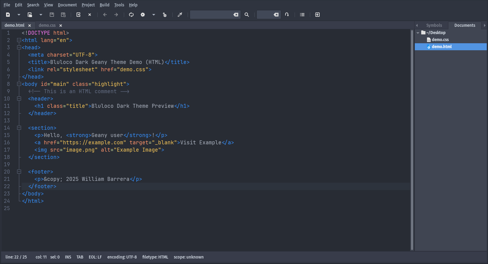
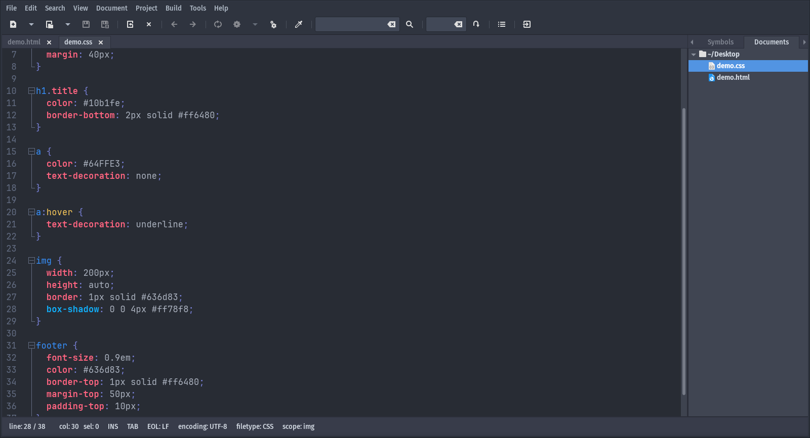

# Bluloco Dark for Geany

A dark theme for the Geany text editor, manually ported by William Barrera.  
Inspired by the Bluloco Dark theme for Visual Studio Code, and structurally based on the Bespin theme from the official Geany Themes repository.

## Preview

<table>
<tr>
<td></td>
<td></td>
</tr>
<tr>
<td align="center">HTML</td>
<td align="center">CSS</td>
</tr>
</table>

## Installation

1. Clone or download this repository.
2. Copy the file `Bluloco-Dark.conf` into your Geany color scheme folder:

   **Linux:**
   ```bash
   mkdir -p ~/.config/geany/colorschemes
   cp themes/Bluloco-Dark.conf ~/.config/geany/colorschemes/
   ```

3. Open Geany and go to:

   ```
   View > Editor > Color Schemes
   ```

   Then select **Bluloco Dark**.

## Included

- `themes/Bluloco-Dark.conf` — the color scheme file.
- `screenshots/preview-html.png` and `screenshots/preview-css.png` — screenshots showing the theme in action.

## Based on

- Bluloco Dark Theme for Visual Studio Code:  
  https://github.com/uloco/theme-bluloco-dark

- Bespin Theme for Geany, from the official Geany Themes repository:  
  https://github.com/geany/geany-themes/blob/master/colorschemes/bespin.conf

## Author

William Barrera  
Manual port and adaptation for Geany.

## License

This project is licensed under the [GNU General Public License v2.0](https://www.gnu.org/licenses/old-licenses/gpl-2.0.html).
Color palette inspired by Bluloco (MIT).
